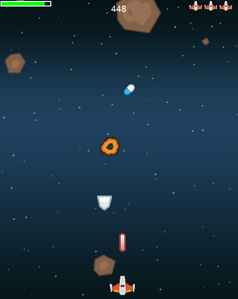

[](https://deepsource.io/gh/j-tesla/space-shooter/?ref=repository-badge)

# space-shooter

[
](https://github.com/pygame/pygame)

*A *shmup* game*

</img>

### Installation

#### Prerequisites

+ [python3](https://www.python.org/downloads/) 
+ [pip](https://pip.pypa.io/en/stable/installing/)
+ [pipenv](https://pipenv-fork.readthedocs.io/en/latest/install.html#installing-pipenv) (suggested)

#### Clone

```shell script
git clone https://github.com/j-tesla/space-shooter.git
```

#### Setup

```shell script
cd space-shooter
```
Install dependencies to a virtual envionment
```sh
pipenv install
```

### Usage

Run *main.py*
```shell script
pipenv run python3 main.py
```

### Build standalone executable (using pyinstaller)

Execute the build script either via docker-compose:
```shell script
docker-compose run pyinstaller
```
or directly execute it locally:
```shell script
./build.sh
```

Afterwards you can find a standalone executable of the game at `dist/space-shooter`.

### License


This project is licensed under the MIT License. For details, check the [LICENSE](LICENSE) file.
